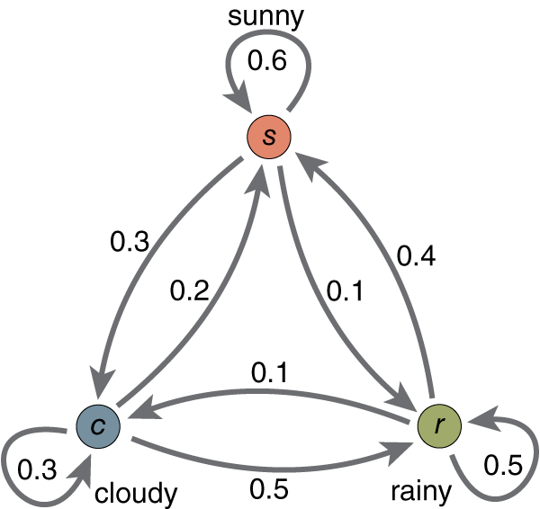

# Trabalho de ITC
## Cadeias de Markov para geração de textos

| Nome                           | Número USP |
|--------------------------------|------------|
| Matheus Aquati Kurianski       |  10687541  |
| Daniel Lima de Jesus           |  10723951  |
| Jonathan Daniel Ramos          |  10857082  |


## Projeto

Nossa ideia foi coletar comentários de produtos do Mercado Livre e gerar comentários falsos com base nos dados que coletamos

## Metodologia

Para coletar os comentários, criamos um Web Scrawler que, em sua configuração padrão, varria a página de ofertas do dia e coletava os comentários dos produtos em promoção. Por limitações técnicas (hardware), conseguimos apenas cerca de 3700 comentários, que achamos ser suficiente para a aplicação.

Para gerar os textos, utilizamos como modelo uma Cadeia de Markov:



Cujo funcionamento é baseado em autômatos finitos, cuja principal diferença é o fato que cada transição possui uma probabilidade atrelada a ela de ocorrer.

Desse modo, sendo um estado inicial uma palavra qualquer, as transições vão ocorrendo até criar uma avaliação _fake_, gerada totalmente pelo modelo.

Os estados iniciais são palavras encontradas no início das avaliações extraídas, e os finais palavras encontradas no fim.

Criamos de modo que seja tanto possível gerar com um número fixo de palavras, quanto até encontrar uma palavra que é um estado final. Como acreditamos que haveriam muitos estados finais, colocamos uma condição extra para que, caso encontrasse um estado final, tenha 50% de chance de parar ali e 50% de continuar, como se jogasse uma moeda. Assim, garantimos frases um pouco mais longas e amplificamos o não-determinismo do modelo.

## Resultados

Um exemplo de saída que obtivemos foi: 

```
'Exatamente esperava excelente fiquei pé não'
'Muito amei minha'
'Adorei qualidade'
'Só testa realmente forte usei excelente. Unico é'
'Bom no caso, bonito e machuco pé'
'Os são largad ótimo, defeito'
'Gostei todas'
'Refletor voo pra., que usado minha e o num de, perfeitamente'
'Muito. O'
'Falando sou, funcionamento. Bom para um para. Muito, média realmente couro mas'
```

Nota-se que poucas frases fazem sentido, ou mesmo estão gramaticamente corretas. Isso se dá, entre outros motivos, pela limitação do modelo das cadeias de Markov, pois se desejássemos melhores resultados teríamos que usar outro modelo, como uma rede neural _Long Short Term Memory_ que possui tratamento de contexto.

Entre outros motivos, está também o alto número de erros gramáticas e incoerências dos comentários extraídos, ou seja, dados "sujos".